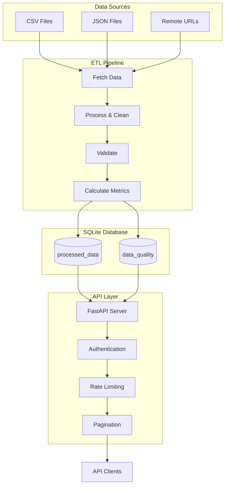

# Data Pipeline and API
## Overview
This repository contains a data pipeline and API for processing and serving 
sales data. The system fetches data from CSV/JSON sources, processes and 
validates it, stores it in a SQLite database, and provides a secure API for 
querying the data.

## Features
### Data Pipeline:
* Fetches data from remote URLs or local files
* Processes and cleans data (name splitting, date conversion, etc.)
* Validates data against schemas
* Calculates data quality metrics
* Stores processed data in SQLite database

### REST API:
* Basic authentication
* Rate limiting
* Query endpoints with filtering capabilities
* Pagination support

## Solution Architecture
### Architecture Overview


## Technology Choices
1. **Polars (Data Processing)**
   * Blazingly fast DataFrame library written in Rust
   * Lazy evaluation for optimal performance
   * Memory-efficient operations
   * Perfect for ETL workloads with its expressive API
   * Outperforms pandas for large datasets

2. **FastAPI (API Framework)**
   * Modern Python framework with excellent performance
   * Automatic OpenAPI/Swagger documentation
   * Built-in data validation with Pydantic
   * Async-ready for high throughput

3. **SQLite (Database)**
   * Lightweight file-based database
   * Zero-configuration setup
   * Excellent for small-to-medium datasets
   * Full SQL support in a portable package

3. **Pandera (Data Validation)**
   * DataFrame validation library
   * Runtime type checking
   * Custom validation rules
   * Clear error reporting

## Why This Stack Works Best
This combination provides:
* **High performance** for data processing (Polars)
* **Type safety** throughout the pipeline (Pandera + Pydantic)
* **Simple deployment** with no external dependencies (SQLite)
* **Modern API** features (FastAPI)

## Project Structure
```
├── .gitignore
├── db/                     # Sample SQLite database
├── data/                   # Sample data files
├── main.py                 # Entry point for pipeline and API
└── src/
    ├── api.py              # FastAPI implementation
    ├── config.yaml         # Configuration file
    ├── pipeline.py         # Data processing pipeline
    └── utils.py            # Shared utilities and schemas
```

## Installation
### Prerequisites
* Python 3.12 (required)
* pip (Python package manager)

## Installation Steps**
1. Clone the repository:
```bash
git clone https://github.com/john-mwangi/data_pipeline
cd data_pipeline
```

2. Create and activate a virtual environment (recommended):
```bash
python -m venv venv
source venv/bin/activate  # Linux/Mac
venv\Scripts\activate     # Windows
```

3. Install dependencies:
```bash
pip install -r requirements.txt
```
## Usage
Running the Pipeline and API.
```bash
# Run both pipeline and API (using remote data sources)
python main.py

# Run pipeline with local data files
python main.py --use_local

# Run API only
python main.py --api_only
```

## API Endpoints
* `POST /get_data` - Retrieve sales data (requires authentication)
  * Parameters:
    * `limit`: Number of records to return (max 1000)
    * `start_date, end_date`: Date range filter
    * `cursor`: Pagination cursor
* `GET /users/me` - Basic authentication test endpoint

## Access & Authentication
The API will be available at `http://localhost:12000` by default. For the 
Swagger documentation, visit `http://localhost:12000/docs`.

Use Basic Auth with credentials from config.yaml (default: admin/admin)

## Data Schemas
### Input Schema
* sales_person: string
* country: string (must be in allowed countries list)
* product: string
* date: string (format: DD-Mon-YY)
* amount: string
* boxes_shipped: integer (max 1000)

### Output Schema
* All input fields (processed)
* first_name, last_name: split from sales_person
* sale_date: date (converted from input date)
* amount: float (cleaned from string)
* Additional metadata fields (run_id, timestamps, etc.)

### Data Quality Metrics
The pipeline calculates and stores:
* Categorical value counts
* Numeric min/max values
* Null counts

## Logging
All operations are logged with timestamps and severity levels.

## Testing
pytest is used for comprehensive testing.
```bash
pytest tests/test_pipeline.py tests/test_api.py -vs
```